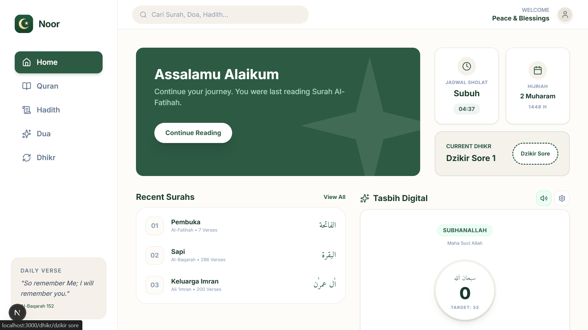

# Noor - Modern Muslim App

<div align="center">
  
</div>

**Noor** adalah aplikasi Muslim modern berbasis web (PWA) yang dirancang dengan antarmuka yang bersih, premium, dan interaktif. Aplikasi ini menyediakan fitur lengkap mulai dari Al-Quran, koleksi Hadis, Doa harian, Dzikir pagi & sore, Tasbih digital, hingga jadwal shalat dinamis dan penanggalan Hijriah.

---

## 🌟 Fitur Utama

- **📖 Al-Quran Digital**: Baca, cari, dan jelajahi Surah-Surah Al-Quran lengkap dengan teks Arab, transliterasi latin, dan terjemahan bahasa Indonesia.
- **📚 Koleksi Hadis**: Akses ke berbagai kitab hadis populer seperti Sahih al-Bukhari, Sahih Muslim, Sunan Abu Dawud, Jami' al-Tirmidhi, dan lainnya.
- **🙏 Doa & Dzikir Harian**: Kumpulan doa harian terorganisir per kategori serta Dzikir Pagi, Dzikir Sore, dan Dzikir setelah Shalat lengkap dengan panduan audio/visual.
- **📿 Tasbih Digital**: Penghitung dzikir interaktif yang responsif dan mudah digunakan langsung dari browser Anda.
- **📅 Jadwal Shalat & Kalender Hijriah**: Penghitungan jadwal shalat otomatis berdasarkan lokasi (browser geolocation) menggunakan metode standar Kemenag (via library `adhan`), disertai penanggalan Hijriah yang akurat.
- **🔒 Sinkronisasi Cloud & Profil**: Mode tamu (bookmark lokal) atau login dengan Google (via Firebase) untuk mencadangkan data favorit Anda secara aman dan sinkron antar-perangkat.
- **📱 PWA Ready**: Instal Noor langsung ke layar beranda perangkat Android, iOS, atau komputer Anda dengan dukungan offline mode.
- **⚙️ Preferensi Kustom**: Pengaturan ukuran font Arab (Kecil, Sedang, Besar) dan opsi untuk menampilkan atau menyembunyikan terjemahan.

---

## 🛠️ Tech Stack

Aplikasi ini dibangun menggunakan teknologi modern:

- **Frontend Framework**: [Next.js 15](https://nextjs.org/) (App Router, React 19)
- **Styling**: [TailwindCSS 4](https://tailwindcss.com/) & [Framer Motion](https://www.framer.com/motion/) (untuk mikro-animasi premium)
- **Database**: [SQLite](https://sqlite.org/) (dioperasikan secara efisien di server-side menggunakan `better-sqlite3`)
- **Authentication & Cloud Storage**: [Firebase Auth & Firestore](https://firebase.google.com/)
- **Prayer Calculations**: [Adhan JS](https://github.com/batoulapps/adhan-js)

---

## 🚀 Instalasi & Konfigurasi Lokal

Ikuti langkah-langkah di bawah ini untuk menjalankan Noor di komputer lokal Anda.

### 📋 Prasyarat

Pastikan Anda telah menginstal **Node.js** (versi 18 ke atas direkomendasikan).

### 🛠️ Langkah-Langkah

1. **Clone/Masuk ke Direktori Proyek**
   ```bash
   cd muslim-app-v1
   ```

2. **Instal Dependensi**
   ```bash
   npm install
   ```

3. **Konfigurasi Environment Variables**
   Salin berkas `.env.example` menjadi `.env` (atau edit file `.env` yang sudah ada):
   ```bash
   cp .env.example .env
   ```
   Buka berkas `.env` lalu sesuaikan kredensial Firebase Anda untuk mengaktifkan sinkronisasi akun Google:
   ```env
   NEXT_PUBLIC_FIREBASE_API_KEY="Kunci_API_Firebase_Anda"
   NEXT_PUBLIC_FIREBASE_AUTH_DOMAIN="muslim-app-xxx.firebaseapp.com"
   NEXT_PUBLIC_FIREBASE_PROJECT_ID="muslim-app-xxx"
   NEXT_PUBLIC_FIREBASE_STORAGE_BUCKET="muslim-app-xxx.firebasestorage.app"
   NEXT_PUBLIC_FIREBASE_MESSAGING_SENDER_ID="SENDER_ID_Anda"
   NEXT_PUBLIC_FIREBASE_APP_ID="APP_ID_Anda"
   ```
   *Catatan: Jika variabel di atas tidak diisi, aplikasi akan otomatis masuk ke **Guest Mode** (Bookmark disimpan secara lokal di browser Anda).*

4. **Inisialisasi & Seed Database**
   Jalankan script untuk mengimpor seluruh data Al-Quran, Hadis, Doa, dan Dzikir ke dalam file database SQLite lokal (`muslim_app.db`):
   ```bash
   npm run db:seed
   ```

5. **Jalankan Server Pengembangan**
   ```bash
   npm run dev
   ```
   Buka [http://localhost:3000](http://localhost:3000) di browser Anda untuk melihat hasilnya.

---

## 📦 Build untuk Produksi

Untuk membuat build produksi yang dioptimalkan:

```bash
npm run build
npm run start
```
